<div align="center">



<br/>


<br/>


</div>

<div align="center"></div>

## `$ whoami`

```text
╭───────────────────────────────╮    eduard@devops
│  ● ● ●     ~/eduard — zsh     │    ─────────────────────────────────────────
├───────────────────────────────┤      host ........ github.com/abyssmemes
│                               │      role ........ DevOps / Platform Engineer
│  $ whoami                     │      uptime ...... 5+ years in production
│  > eduard lugovtsov           │      cloud ....... AWS · GCP · Oracle Cloud
│                               │      orchestr .... Kubernetes · Helm · Argo CD
│  $ cat role.txt               │      iac ......... Terraform · Pulumi (Go)
│  > devops / platform engineer │      ci/cd ....... Jenkins · GH Actions · GitLab
│                               │      observe ..... Datadog · Grafana · Prometheus
│  $ ./status --now             │      security .... Vault · Keycloak · WireGuard
│  > shipping code. always.     │      open-source . Element · Matrix Synapse
│  ▮                            │      shell ....... bash · go · groovy · java
╰───────────────────────────────╯      status ...... automating the boring stuff
```

> DevOps / Platform Engineer with **5+ years** keeping production calm — designing
> multi-cloud infrastructure, running Kubernetes at scale, and building CI/CD that
> ships without drama. I treat infrastructure as code, on-call as a solvable
> problem, and cloud bills as something to shrink. Open-source contributor to
> **Element Messenger** and **Matrix Synapse**. B.Sc. Computer Science.

## `$ tail -f impact.log`

```text
# wins worth committing

[ ok ]  legacy infra migrated to Terraform IaC ......... infra cost       ▼ 60%
[ ok ]  CI/CD pipelines rebuilt: Jenkins + Argo CD ..... pipeline speed   ▲ 40%
[ ok ]  multi-cloud automation with Pulumi (Go) ........ release time     ▼ 35%
[ ok ]  level-2 PagerDuty on-call rotation ............. prod uptime      24/7
```

<div align="center"></div>

## `$ tech --stack`

| `layer` | `tooling` |
|:--|:--|
| **Cloud** |       |
| **Containers & Orchestration** |    |
| **Infrastructure as Code** |    |
| **CI/CD & GitOps** |     |
| **Observability** |       |
| **Security & Networking** |      |
| **Databases** |     |
| **Languages** |       |
| **Tooling & VCS** |        |

<div align="center"></div>

## `$ ./monitor --dashboard`

<div align="center">


<br/>


<br/>


<br/>


</div>

<div align="center"></div>

## `$ git log --trophies`

<div align="center">


</div>

<div align="center"></div>

## `$ ./connect --me`

<div align="center">

[](https://www.linkedin.com/in/eduard-lugovtsov-92486116b)
[](mailto:abyssmemes@gmail.com)
[](https://github.com/abyssmemes)

</div>

<div align="center"></div>

<div align="center">

```text
eduard@devops:~$ exit
> connection closed. thanks for stopping by — now go ship something. ▮
```

</div>
